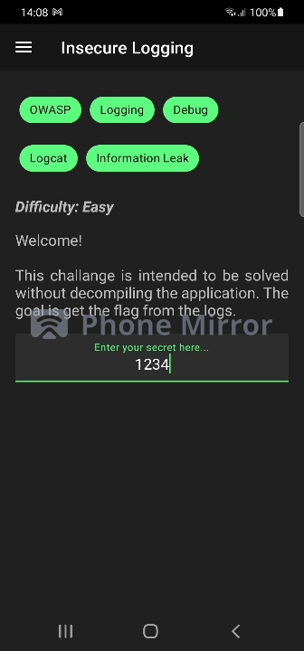

## Insecure Logging 📝

During development many programmers use logs as a form of testing their application
in Android the developers can use the Log command to log information, these logs can be
very helpful to understand what is happening however the developer should be cautious


### Difficulty: Easy 🤓

### Challenge
This challenge is intended to be solved without decompiling the application. The goal is to get the flag from the application logs.

### Tools used 📱

- Rooted Phone
- Computer
- ADB

⚠️ Always check if adb and frida server are running by doing the commands **adb devices** and **frida-ps -U**.

### Hint

These challenge can be solved using only ADB and in concrete a tool called **Logcat**. 

### What is Logcat?

Logcat is a command-line tool that dumps a log of system messages, including stack traces when the device throws an error and messages that you have written from your app with the Log class.

The command **logcat** lets users capture the logs that are
currently being transmitted on their phone.

### Guide

#### Step 1

Start by seeing if Frida is finding the application Allsafe process (the app needs to be running).

```bash
frida-ps -U
```

The output should be something like this:

```
ID      Name
-----  ----------------
30026   Allsafe
...    ...
```

#### Step 2 

The next step is to go to the Insecure Logging Level, there will be a textbox for the user to write something.

Write whatever you want.



#### Step 3

Now we need to collect the logs from the application using Logcat.

You can use the command:

```bash
adb logcat
```

However this would flood you command line with logs from you whole phone

You can trim the information by running logcat only on a specific application, using the **package name**

In this case: **infosecadventures.allsafe**  (if you do not know the package of an application use adb shell and scan the data directory)

```bash
adb logcat infosecadventures.allsafe
```

To facilitate your analysis dump the information in a text file so its easier to analyze.

```bash
adb logcat infosecadventures.allsafe > dump.txt
```

#### Step 4

Now since we know the field is called secret from the challenge we can use Unix commands to analyze the text file.

```bash
cat dump.txt | grep secret
```

Your result should be something like this:

```
06-01 12:52:50.480  4244  5977 I LockSettingsService: Unlocking user 0 with secret only, length 136
06-01 14:08:27.291  4244  9209 I LockSettingsService: Unlocking user 0 with secret only, length 136
06-01 14:08:44.597  9998  9998 I [SPAF]AutofillHints: findFromEditText() / entry [secret], hint [Enter your secret here...] => username
06-01 14:08:44.598  9998  9998 I [SPAF]MetadataCollect: Add: 8, secret
06-01 14:08:50.277 30026 30026 D ALLSAFE : User entered secret: 1234
```

As you can see in the last line it is possible to see the code that as been entered by the user using Logcat, in this case 1234.

### End

This is all for the first level, with this it is possible to understand that with acess to Logcat an attacker can search for specific information in an application, this can be dangerous if the attacker finds a API token or password.

### Links
**[Logcat]**: Documentation for Logcat

**[Coinbase]**: Coinbase information leak using Logcat

<!--Links-->
[Logcat]: <https://developer.android.com/studio/command-line/logcat>
[Coinbase]: <https://hackerone.com/reports/5314>

