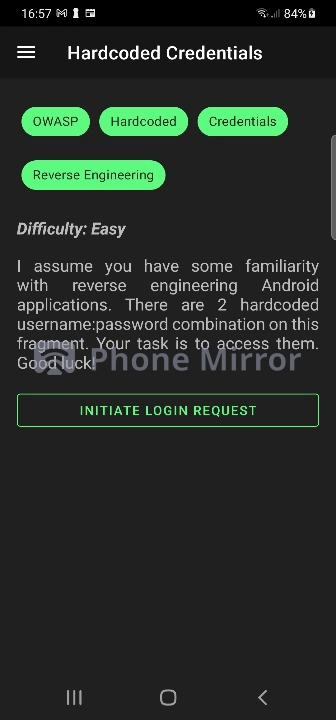
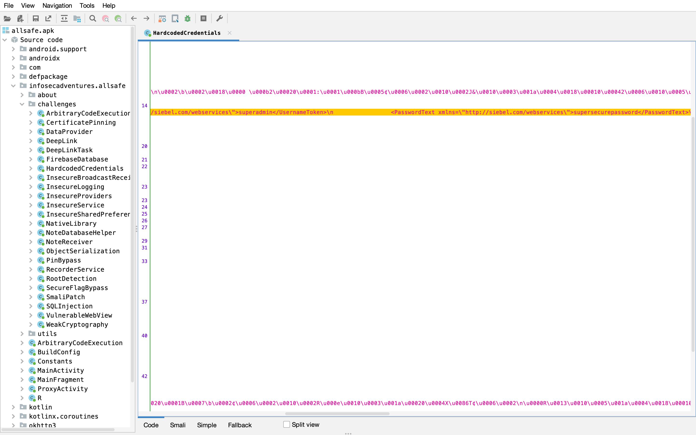

## Hardcoded Credentials 📜

Like in the challenge before sometimes the biggest threat to an application can be the programmer himself,
one of the most common practices in programming is to write comments in the code files so the programmer can later remember 
what the specific function does or even help other programmers. Comments are not a bad thing and are needed, however 
the programmer needs to pay attention to what we writes in the comments.

Normally app developers do not really care for this practice since the end user does not have access to
the source code, however this can be their demise in case an attacker **reverse engineers** the code.



### Difficulty: Easy 🤓

### Challenge
There is a username and a password hardcoded in the comments of the activity, the job is to obtain 
them using reverse engineering.

### Tools used 📱

- Rooted Phone
- Computer
- ADB
- Reverse Engineering Tool (ex JADX, apktool....)

⚠️ Always check if adb and frida server are running by doing the commands **adb devices** and **frida-ps -U**.

### Hint

These challenge can be solved by analyzing the code of the activity. 

### What is Reverse Engineering?

The process of reverse engineering and application is to transform an apk file in their respective source code,
these process is not easy and the code is rarely 100% decompiled, so this process is good for analyzing how the application
works, however it can also be used to inject foreign code and see how the application will handel it however this process
is difficult and app will likely crash.

There are various tools for reverse engineering an app the two most popular tools are **JADX** (if you use kali for mobile pentesting you likely know this tool)
and **apktool**. Both are great tools however JADX is more popular since their results are more accurate and the user can run it via command line or GUI.

In the guide i will use JADX (executable for windows and hombrew for mac) however the command line process is really similiar with apktool so you can that.

⚠️You will need Java 11 to run JADX.


### Guide

#### Step 1

The first step is getting the apk file in your computer, you can of course download it via and APK store (example apkpure) or use
ADB and pull it from the Phone (requires root). The apk is stored in the directory **/data/app**.

Since Android 8, the name of the app folders are encrypted, so to get the right folder use the following command
to help find the folder connected to the app package.

```bash
adb shell pm path infosecadventures.allsafe
```

The output should be something like this:

```
package:/data/app/infosecadventures.allsafe-nfFSVxn_CTafgra3Fr_rXQ==/base.apk
```

Pull the application with the adb pull command:

```bash
adb pull /data/app/infosecadventures.allsafe-nfFSVxn_CTafgra3Fr_rXQ==/base.apk
```

#### Step 2

The next step is to decompile the application using JADX, this can be done in two ways:
- Using the terminal
- Using the GUI

Bot will be explained here

### Using the command Line

#### Step 3

To decompile the application using the command line run:

```bash
jadx base.apk
```

These will create a folder called base with the code. Now it is a question of knowing the structure of a Android application.

#### Step 4

The activities are inside the direcotry **/source/infosecadventurers/allsafe/challenges**, inside this folder are
the activities of this application, in our case the file that we want is **HardcodedCredentials.java**.

To find the information more easly use a grep command with combination of a cat command and try and search for useful information.

```bash
cat HardcodedCredentials.java | grep password
```

Your result should be something like this:

```
public static final String BODY = "\n            
<soap:Envelope xmlns:soap=\"http://schemas.xmlsoap.org/soap/envelope/\">\n           
<soap:Header>\n                 
<UsernameToken xmlns=\"http://siebel.com/webservices\">superadmin</UsernameToken>\n                
<PasswordText xmlns=\"http://siebel.com/webservices\">supersecurepassword</PasswordText>\n                
<SessionType xmlns=\"http://siebel.com/webservices\">None</SessionType>\n           
</soap:Header>\n            <soap:Body>\n                 <!-- data goes here -->\n            
</soap:Body>\n            </soap:Envelope>\n        ";
```

The username is: superadmin and the password supersecurepassword!


### Using GUI

#### Step 3
The JADX GUI can be really usefull specially for people that are used to Android Studio since the interface is
very similar.

To open the GUI in Unix system use:

```bash
jadx-gui
```

This will open the GUI automatically and ask you for a apk file, after that it will decompile the application.

Here we follow the file structure **/infosecadventurers/allsafe/challenges** and open the file **HardcodedCredentials.java**,
to facilitate the search use ctrl+f (or cmd+f) and search for specific keywords like password.

The username is: superadmin and the password supersecurepassword!



### End

This is all for the second level! There is much more to know about reverse engineering apps, and it is one of the most
challenging tests for hackers, however this rundown helps understand how to decompile a application and search for artifacts left by the programmer.

### Links
**[JADX]**: JADX Github

**[8x8]**: Hardcoded URL API in application

**[Zomato]**: Credentials for development enviorment were left in the application

**[Zomato]**: Auth API information was left in the application in plain text

<!--Links-->
[JADX]: <https://github.com/skylot/jadx>
[8x8]: <https://hackerone.com/reports/412772>
[Zomato]: <https://hackerone.com/reports/246995>
[8x8]: <https://hackerone.com/reports/412772>
[Reverb]: <https://hackerone.com/reports/351555>

