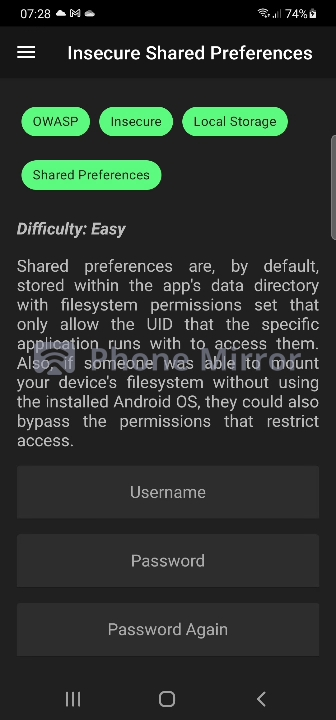

## Insecure Shared Preferences 

These challenge is pretty simple, however it is a very important challenge because we talk about a very important
file in Android development that is **Shared Preferences**, the challenge is not difficult to do if you already
have a rooted phone you only need ADB on your pc.



### Difficulty: Easy 🤓

### Challenge
Shared Preferences

### Tools used 📱

- Rooted Phone
- Computer
- ADB

⚠️ Always check if adb and frida server are running by doing the commands **adb devices** and **frida-ps -U**.

### Hint

These challenge can be solved by analyzing the code of the activity. 

### What is Shared Preferences?

A SharedPreference file is a simple XML file which belongs to your application. You can store key-value pairs of data which your app requires often.

Most often, it can be used as some sort of cache/cookie which will be useful when the user's detail/action is to be remembered when he comes back to use the application.

Some of the common uses of shared preferences (but not limited to):

- You can use shared preferences to check if the user is logged in, and if he is logged in to your application you can direct him to the dashboard and if not, show him the login/register page.

- Show the first time users the demo of your app. Most of the apps today shows the users who opens the app for the first time about the app, how to use it and what is where kind of things.

- Some information which is needed across different activities and hard to pass through intents and not important enough to store in DB.

### Guide

#### Step 1

The first step is completing the form with a name and a password and hitting the register button.


#### Step 2

After registering just connect your phone to the pc and open ADB.

The shared preference file is a sensitive file so it is stored in the private directory of the application in **/data/data**.

Start by opening a ADB Shell and enter root user:

```bash
adb shell
su
```

After go to the private directory and enter in the application directory:

```bash
cd /data/data/infosecadventurers.allsafe
```

#### Step 3

Inside the private folder is a directory called **shared_prefs** here is where all the xml files from the perfernces are stored.

Enter the directory:

```bash
cd shared_prefs
```

Now if you list the directory you should have a xml filed called users, just read the file with the cat command.

```bash
cat user.xml
```

Your result should be something like this:

```xml
<?xml version='1.0' encoding='utf-8' standalone='yes' ?>
<map>
    <string name="password">1234</string>
    <string name="username">fabian</string>
</map>
```

Congratulations! You got your username and password!

### End

This is all for the fourth level! Shared Preferences are one of the most essential tools in android applications,
we dont always need a database to store everything, not only would it be resource consuming, it would complicate the life
of the programmer to implement features like session presistence. However the developer needs to have caution what he
saves in this file, because with is possible to read its contents if you have access to the private directory.

### Links
**[Shared]**: SharedPreferences Documentation

**[Cloud]**: Leak arbitrary file under nextcloud android client privacy directory

**[Vine]**: Insecure Data Storage in Vine Android App


<!--Links-->
[Shared]: <https://developer.android.com/reference/android/content/SharedPreferences>
[cloud]: <https://hackerone.com/reports/1142918>
[vine]: <https://hackerone.com/reports/44727>

